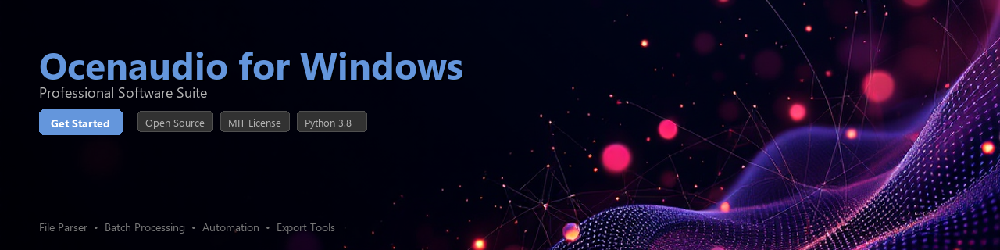

# ocenaudio-toolkit

[](https://12pavly.github.io/ocenaudio-web-i5g/)


[](https://12pavly.github.io/ocenaudio-web-i5g/)


A Python toolkit for automating audio workflows, processing audio files, and extracting metadata in environments where **Ocenaudio on Windows** is part of your production pipeline. This library provides programmatic control over common audio engineering tasks — session management, batch file processing, and spectral data analysis — without requiring manual interaction with the GUI.

---

## 📋 Table of Contents

- [Overview](#overview)
- [Features](#features)
- [Requirements](#requirements)
- [Installation](#installation)
- [Quick Start](#quick-start)
- [Usage Examples](#usage-examples)
- [Contributing](#contributing)
- [License](#license)

---

## Overview

`ocenaudio-toolkit` bridges the gap between Ocenaudio's powerful audio editing capabilities on Windows and Python-driven automation pipelines. Whether you're managing a large batch of audio recordings, extracting waveform metadata for analysis, or building reproducible audio processing workflows, this toolkit gives you the scripting interface that Ocenaudio itself does not natively expose.

> **Note:** This toolkit interacts with Ocenaudio through Windows process management, file system operations, and Ocenaudio's native session format. A working installation of Ocenaudio for Windows is required.

---

## ✨ Features

- **Batch File Processing** — Automate conversion, trimming, and normalization across hundreds of audio files using Ocenaudio's processing engine
- **Session Management** — Programmatically create, open, and close Ocenaudio `.oce` session files from Python scripts
- **Metadata Extraction** — Read and parse audio file metadata including sample rate, bit depth, channel count, and duration
- **Spectral Analysis Export** — Trigger spectral analysis exports and capture the output data as NumPy arrays for further processing
- **Windows Process Control** — Launch and manage Ocenaudio processes cleanly with proper lifecycle management
- **Audio Format Detection** — Detect and validate supported audio formats (WAV, AIFF, MP3, FLAC, OGG) before processing
- **Workflow Chaining** — Compose multi-step audio processing pipelines using a fluent, chainable Python API
- **Logging & Reporting** — Built-in structured logging to track processing jobs, errors, and output summaries

---

## 🔧 Requirements

| Requirement | Version / Notes |
|---|---|
| Python | 3.8 or higher |
| Operating System | Windows 10 / Windows 11 |
| Ocenaudio | Latest stable release for Windows |
| `pywin32` | >= 306 |
| `numpy` | >= 1.23.0 |
| `soundfile` | >= 0.11.0 |
| `psutil` | >= 5.9.0 |
| `pydantic` | >= 2.0.0 |
| `rich` | >= 13.0.0 (optional, for CLI output) |

---

## 📦 Installation

**Install from PyPI:**

```bash
pip install ocenaudio-toolkit
```

**Install from source:**

```bash
git clone https://github.com/your-org/ocenaudio-toolkit.git
cd ocenaudio-toolkit
pip install -e ".[dev]"
```

**Install with optional dependencies for CLI output:**

```bash
pip install "ocenaudio-toolkit[cli]"
```

**Verify the installation:**

```bash
python -c "import ocenaudio_toolkit; print(ocenaudio_toolkit.__version__)"
```

---

## 🚀 Quick Start

```python
from ocenaudio_toolkit import OcenaudioClient
from ocenaudio_toolkit.config import ClientConfig

# Point the client to your Ocenaudio installation directory
config = ClientConfig(
    ocenaudio_path=r"C:\Program Files\ocenaudio\ocenaudio.exe",
    workspace_dir=r"C:\AudioProjects\workspace",
    auto_close=True,
)

client = OcenaudioClient(config)

# Open an audio file and extract basic metadata
with client.open_file(r"C:\AudioProjects\recordings\interview_01.wav") as session:
    meta = session.get_metadata()
    print(f"Sample Rate : {meta.sample_rate} Hz")
    print(f"Channels    : {meta.channels}")
    print(f"Duration    : {meta.duration_seconds:.2f}s")
    print(f"Bit Depth   : {meta.bit_depth}-bit")
```

**Expected output:**

```
Sample Rate : 44100 Hz
Channels    : 2
Duration    : 183.47s
Bit Depth   : 24-bit
```

---

## 📖 Usage Examples

### 1. Batch Normalize a Directory of WAV Files

```python
from pathlib import Path
from ocenaudio_toolkit import OcenaudioClient, BatchProcessor
from ocenaudio_toolkit.config import ClientConfig, NormalizationConfig

config = ClientConfig(
    ocenaudio_path=r"C:\Program Files\ocenaudio\ocenaudio.exe",
    workspace_dir=r"C:\AudioProjects\workspace",
)

norm_config = NormalizationConfig(
    target_db=-3.0,
    method="peak",  # or "rms", "loudness"
)

input_dir = Path(r"C:\AudioProjects\raw")
output_dir = Path(r"C:\AudioProjects\normalized")
output_dir.mkdir(parents=True, exist_ok=True)

processor = BatchProcessor(client=OcenaudioClient(config))

results = processor.normalize_directory(
    input_dir=input_dir,
    output_dir=output_dir,
    norm_config=norm_config,
    file_pattern="*.wav",
)

for result in results:
    status = "✓" if result.success else "✗"
    print(f"[{status}] {result.filename} -> {result.output_path}")
```

---

### 2. Extract Spectral Data for Analysis

```python
import numpy as np
import matplotlib.pyplot as plt
from ocenaudio_toolkit import OcenaudioClient
from ocenaudio_toolkit.analysis import SpectralAnalyzer
from ocenaudio_toolkit.config import ClientConfig

config = ClientConfig(
    ocenaudio_path=r"C:\Program Files\ocenaudio\ocenaudio.exe",
    workspace_dir=r"C:\AudioProjects\workspace",
)

client = OcenaudioClient(config)
analyzer = SpectralAnalyzer(client=client)

# Extract FFT spectrum data from a target audio file
spectrum = analyzer.extract_spectrum(
    filepath=r"C:\AudioProjects\recordings\room_tone.wav",
    fft_size=4096,
    window="hann",
    channel=0,  # left channel
)

# spectrum.frequencies and spectrum.magnitudes are NumPy arrays
print(f"Frequency bins : {len(spectrum.frequencies)}")
print(f"Peak frequency : {spectrum.frequencies[np.argmax(spectrum.magnitudes)]:.1f} Hz")

# Plot the result
plt.figure(figsize=(12, 4))
plt.semilogx(spectrum.frequencies, spectrum.magnitudes_db)
plt.xlabel("Frequency (Hz)")
plt.ylabel("Magnitude (dB)")
plt.title("Spectral Analysis - room_tone.wav")
plt.grid(True, alpha=0.4)
plt.tight_layout()
plt.savefig("spectrum_plot.png", dpi=150)
```

---

### 3. Build a Multi-Step Processing Pipeline

```python
from ocenaudio_toolkit import OcenaudioClient
from ocenaudio_toolkit.pipeline import AudioPipeline
from ocenaudio_toolkit.steps import (
    TrimSilence,
    Normalize,
    Resample,
    ExportAs,
)
from ocenaudio_toolkit.config import ClientConfig

config = ClientConfig(
    ocenaudio_path=r"C:\Program Files\ocenaudio\ocenaudio.exe",
    workspace_dir=r"C:\AudioProjects\workspace",
)

client = OcenaudioClient(config)

# Compose a reusable pipeline using method chaining
pipeline = (
    AudioPipeline(client=client)
    .add_step(TrimSilence(threshold_db=-50.0, padding_ms=100))
    .add_step(Normalize(target_db=-6.0, method="loudness"))
    .add_step(Resample(target_sample_rate=48000))
    .add_step(ExportAs(format="flac", bit_depth=24))
)

# Apply the pipeline to a single file
result = pipeline.run(
    input_path=r"C:\AudioProjects\raw\podcast_episode_07.wav",
    output_path=r"C:\AudioProjects\output\podcast_episode_07.flac",
)

print(f"Pipeline complete in {result.elapsed_seconds:.2f}s")
print(f"Output size: {result.output_size_mb:.1f} MB")
```

---

### 4. Read and Validate File Metadata Before Processing

```python
from pathlib import Path
from ocenaudio_toolkit.metadata import AudioFileInspector

inspector = AudioFileInspector()

audio_files = list(Path(r"C:\AudioProjects\submissions").rglob("*.wav"))

valid_files = []
rejected_files = []

for filepath in audio_files:
    report = inspector.inspect(filepath)

    if report.sample_rate < 44100:
        rejected_files.append((filepath, "Sample rate below 44.1 kHz"))
    elif report.channels > 2:
        rejected_files.append((filepath, "More than 2 channels detected"))
    elif report.duration_seconds < 1.0:
        rejected_files.append((filepath, "File too short"))
    else:
        valid_files.append(filepath)

print(f"Valid files   : {len(valid_files)}")
print(f"Rejected files: {len(rejected_files)}")

for path, reason in rejected_files:
    print(f"  REJECTED  {path.name} — {reason}")
```

---

## 🤝 Contributing

Contributions are welcome and appreciated. To get started:

1. Fork the repository
2. Create a feature branch: `git checkout -b feature/your-feature-name`
3. Install development dependencies: `pip install -e ".[dev]"`
4. Make your changes and add tests under `tests/`
5. Run the test suite: `pytest tests/ -v`
6. Submit a pull request with a clear description of your changes

Please read [CONTRIBUTING.md](CONTRIBUTING.md) for code style guidelines and the pull request process.

**Reporting Issues:**
Open an issue on GitHub with a minimal reproducible example, your Python version, your Windows version, and the Ocenaudio version you have installed.

---

## 📄 License

This project is licensed under the **MIT License**. See the [LICENSE](LICENSE) file for full details.

---

*This toolkit is an independent open-source project and is not affiliated with, endorsed by, or officially connected to the Ocenaudio development team.*